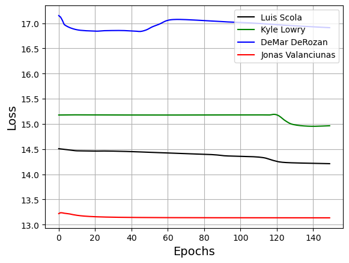

# Multi-Agent GAIL

## Demo
Just need to download the notebook file, model file and the datasets folder. 
The notebook follows a step by step approach to extract, pre-process and train the netowrk.

## Description
The datasets folder has 7z files of the SportsVU data collected for the 2015-16 season. 
The notebook attempts to extract files of choice into a json file which is stored in the data folder (not necessary to download). 
The model.py has the blueprint of the Actor, Discriminator and Value networks that will be used during training. 
Hyperparameters can be adjusted within the notebook to train the model. 

The output is a visualization of training losses over time (should look something like the image below):

